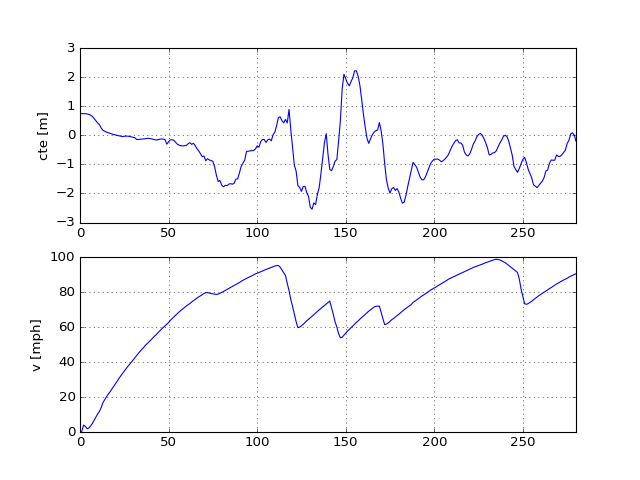

# MPC Lane Keeping Project
[](http://www.udacity.com/drive)

Udacity Self-Driving Car Engineer Nanodegree Program
* Objective: Make self-driving car **keep lane** by using both `steering` and `throttle(brake)`.
* Method: Model Predictive Control(MPC)
  * Number of Horizon (N): `20`
  * Elapsed Duration (dt): `50 ms`

Result
---
If you want to see full version video, click [`Youtube link`](https://youtu.be/lvGuNVJdAKU). 
The vehicle was able to run without leaving the lane at maximum speed `100 mph (160 km/h)` with `100 ms` latency.
<p align="center">
  
  
</p>

Vehicle Models and MPC Implementation
---
### Vehicle Model

* Model : **Kinematic** based vehicle model. This dose not consider dynamics such as slip angle and slip ratio. States of the vehicle model can be divided into **vehicle states** and **error states**.
* Vehicle States: [x, y, psi, v] where `x`, `y` is vehicle position in vehicle's coordinates, `psi` is yaw angle and `v` is velocity.
* Error States: [cte, epsi] where `cte` is cross track error and `epsi` is heading error. It uses `f(x)`, which is a polynomial fitted to waypoints.

So, basic version of vehicle model is as follow:
```
  x[t+1] = x[t] + v[t] * cos(psi[t]) * dt
  y[t+1] = y[t] + v[t] * sin(psi[t]) * dt
  psi[t+1] = psi[t] + v[t] / Lf * delta[t] * dt
  v[t+1] = v[t] + a[t] * dt
  cte[t+1] = f(x[t]) - y[t] + v[t] * sin(epsi[t]) * dt
  epsi[t+1] = psi[t] - psides[t] + v[t] * delta[t] / Lf * dt
```

### MPC Implementation
#### Cost
* `Reference states`: minimize error to referenece states. (cte = 0, epsi = 0, v = ref_v)
* `Use of actuator`: minimize the use of actuator.
* `Value gap between sequential actuation`: minimize the value gap. This helps the vehicle move smoothly.
* `Terminal heading error`: minimize the heading error at last of the horizon(N). This helps the vehicle move more stable.

```
  //**** cost function ****//
  fg[0] = 0;

  // reference state
  for(size_t h = 0; h < N; h++){
    fg[0] += CppAD::pow(vars[cte_start + h], 2) * w_cte;
    fg[0] += CppAD::pow(vars[epsi_start + h], 2) * w_epsi;
    fg[0] += CppAD::pow(vars[v_start + h] - ref_v, 2) * w_v;
  }

  // minimize the use of actuator
  for(size_t h = 0; h < N-1; h++){
    fg[0] += CppAD::pow(vars[delta_start + h], 2) * w_delta;
    fg[0] += CppAD::pow(vars[a_start + h], 2) * w_a;
  }

  // minimize the value gap between sequential actuations
  for(size_t h = 0; h < N-2; h++){
    fg[0] += CppAD::pow(vars[delta_start + h + 1] - vars[delta_start + h], 2) * w_delta_diff;
    fg[0] += CppAD::pow(vars[a_start + h + 1] - vars[a_start + h], 2) * w_a_diff;
  }

  // terminal cost for heading
  for(size_t h = N-3; h < N; h++){
    fg[0] += CppAD::pow(vars[epsi_start + h], 2) * w_epsi_term;
  }
```

#### Constraints
* Only consider actuator limits (`steering` and `throttle`)

### Latency issue
#### Problem
* 100 millisecond latency deteriorates control performance.

#### Solution  
1. **Look-ahead distance:** 
One of the simple solution is to control the vehicle with look-ahead distance. Just like a real person driving, seeing far away helps the system to ensure stability. I designed MPC to minimize cte from look-ahead distance, not from 0 in x-direction. This method *indirectly* reduces problems caused by latency, but it is not a fundamental solution.
```
  // set look-ahead distance
  double d_ahead = v * 0.15; 

  // cte at look-ahead distance
  double cte = polyeval(coeffs, d_ahead);
```
2. **Explicitly model latency on MPC formulation:**
This is *direct* method to deal with latency problem. We can explicitly model 100ms latency on MPC formulation. As `dt` is 50ms, the control inputs at `t` affects all states at `t+2`. So the basic version of vehicle model can change as follow.
```
  x[t+3] = x[t+2] + v[t+2] * cos(psi[t+2]) * dt
  y[t+3] = y[t+2] + v[t+2] * sin(psi[t+2]) * dt
  psi[t+3] = psi[t+2] + v[t+2] / Lf * delta[t] * dt
  v[t+3] = v[t+2] + a[t] * dt
  cte[t+3] = f(x[t+2]) - y[t+2] + v[t+2] * sin(epsi[t+2]) * dt
  epsi[t+3] = psi[t+2] - psides[t+2] + v[t+2] * delta[t] / Lf * dt
```
Please pay attention that `a[t]` and `delta[t]` updates states at `t+2`

Basic Build Instructions
---

1. Clone this repo.
2. Make a build directory: `mkdir build && cd build`
3. Compile: `cmake .. && make`
4. Run it: `./mpc`.

Dependencies
---

* cmake >= 3.5
 * All OSes: [click here for installation instructions](https://cmake.org/install/)
* make >= 4.1
  * Linux: make is installed by default on most Linux distros
  * Mac: [install Xcode command line tools to get make](https://developer.apple.com/xcode/features/)
  * Windows: [Click here for installation instructions](http://gnuwin32.sourceforge.net/packages/make.htm)
* gcc/g++ >= 5.4
  * Linux: gcc / g++ is installed by default on most Linux distros
  * Mac: same deal as make - [install Xcode command line tools]((https://developer.apple.com/xcode/features/)
  * Windows: recommend using [MinGW](http://www.mingw.org/)
* [uWebSockets](https://github.com/uWebSockets/uWebSockets)
  * Run either `install-mac.sh` or `install-ubuntu.sh`.
  * If you install from source, checkout to commit `e94b6e1`, i.e.
    ```
    git clone https://github.com/uWebSockets/uWebSockets 
    cd uWebSockets
    git checkout e94b6e1
    ```
    Some function signatures have changed in v0.14.x. See [this PR](https://github.com/udacity/CarND-MPC-Project/pull/3) for more details.
* Fortran Compiler
  * Mac: `brew install gcc` (might not be required)
  * Linux: `sudo apt-get install gfortran`. Additionall you have also have to install gcc and g++, `sudo apt-get install gcc g++`. Look in [this Dockerfile](https://github.com/udacity/CarND-MPC-Quizzes/blob/master/Dockerfile) for more info.
* [Ipopt](https://projects.coin-or.org/Ipopt)
  * Mac: `brew install ipopt`
  * Linux
    * You will need a version of Ipopt 3.12.1 or higher. The version available through `apt-get` is 3.11.x. If you can get that version to work great but if not there's a script `install_ipopt.sh` that will install Ipopt. You just need to download the source from the Ipopt [releases page](https://www.coin-or.org/download/source/Ipopt/) or the [Github releases](https://github.com/coin-or/Ipopt/releases) page.
    * Then call `install_ipopt.sh` with the source directory as the first argument, ex: `bash install_ipopt.sh Ipopt-3.12.1`. 
  * Windows: TODO. If you can use the Linux subsystem and follow the Linux instructions.
* [CppAD](https://www.coin-or.org/CppAD/)
  * Mac: `brew install cppad`
  * Linux `sudo apt-get install cppad` or equivalent.
  * Windows: TODO. If you can use the Linux subsystem and follow the Linux instructions.
* [Eigen](http://eigen.tuxfamily.org/index.php?title=Main_Page). This is already part of the repo so you shouldn't have to worry about it.
* Simulator. You can download these from the [releases tab](https://github.com/udacity/self-driving-car-sim/releases).
* Not a dependency but read the [DATA.md](./DATA.md) for a description of the data sent back from the simulator.